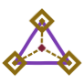
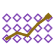

<picture><source media="(prefers-color-scheme: dark)" srcset="assets/espiral-header.svg"></picture>

> *Entre más largo el mensaje, es mayor la probabilidad de malinterpretaciones.*

<picture><source media="(prefers-color-scheme: dark)" srcset="assets/divider-step.svg"></picture>

### Puedes encontrarme en:

<table>
<tr>
<td align="center" width="96"><a href="https://linkedin.com/in/cristiandavella"><picture><source media="(prefers-color-scheme: dark)" srcset="assets/icons/linkedin.svg"></picture></a> LinkedIn</td>
<td align="center" width="96"><a href="https://platzi.com/p/CristianDAvella"><picture><source media="(prefers-color-scheme: dark)" srcset="https://cdn.simpleicons.org/platzi/C9A227"></picture></a> Platzi</td>
</tr>
</table>

<picture><source media="(prefers-color-scheme: dark)" srcset="assets/divider-crack.svg"></picture>

### En qué estoy trabajando ahora:

- **Agencia de empleos:** un bot con Playwright que une perfiles con vacantes.
- **Servidor casero:** servicios open source montados en casa. *Lo próximo.*

<picture><source media="(prefers-color-scheme: dark)" srcset="assets/divider-step.svg"></picture>

### Lenguajes y herramientas:

<table>
<tr>
<td><b>DATOS</b></td>
<td align="center" width="88"><picture><source media="(prefers-color-scheme: dark)" srcset="https://cdn.simpleicons.org/python/C9A227"></picture> Python</td>
<td align="center" width="88"><picture><source media="(prefers-color-scheme: dark)" srcset="https://cdn.simpleicons.org/pandas/C9A227"></picture> Pandas</td>
<td align="center" width="88"><picture><source media="(prefers-color-scheme: dark)" srcset="https://cdn.simpleicons.org/postgresql/C9A227"></picture> PostgreSQL</td>
<td align="center" width="88"><picture><source media="(prefers-color-scheme: dark)" srcset="https://cdn.simpleicons.org/mysql/C9A227"></picture> MySQL</td>
<td align="center" width="88"><picture><source media="(prefers-color-scheme: dark)" srcset="https://cdn.simpleicons.org/apacheairflow/C9A227"></picture> Airflow</td>
<td align="center" width="88"><picture><source media="(prefers-color-scheme: dark)" srcset="assets/icons/powerbi.svg"></picture> Power BI</td>
</tr>
<tr>
<td><b>AUTOMATIZACIÓN</b></td>
<td align="center"><picture><source media="(prefers-color-scheme: dark)" srcset="https://cdn.simpleicons.org/python/C9A227"></picture> Python</td>
<td align="center"><picture><source media="(prefers-color-scheme: dark)" srcset="assets/icons/playwright.svg"></picture> Playwright</td>
<td align="center"><picture><source media="(prefers-color-scheme: dark)" srcset="https://cdn.simpleicons.org/gnubash/C9A227"></picture> Bash</td>
<td align="center"><picture><source media="(prefers-color-scheme: dark)" srcset="assets/icons/powershell.svg"></picture> PowerShell</td>
<td></td>
<td></td>
</tr>
<tr>
<td><b>MÓVIL</b></td>
<td align="center"><picture><source media="(prefers-color-scheme: dark)" srcset="https://cdn.simpleicons.org/kotlin/C9A227"></picture> Kotlin</td>
<td align="center"><picture><source media="(prefers-color-scheme: dark)" srcset="https://cdn.simpleicons.org/androidstudio/C9A227"></picture> Android Studio</td>
<td></td>
<td></td>
<td></td>
<td></td>
</tr>
<tr>
<td><b>INFRAESTRUCTURA Y NUBE</b></td>
<td align="center"><picture><source media="(prefers-color-scheme: dark)" srcset="https://cdn.simpleicons.org/linux/C9A227"></picture> GNU/Linux</td>
<td align="center"><picture><source media="(prefers-color-scheme: dark)" srcset="https://cdn.simpleicons.org/docker/C9A227"></picture> Docker</td>
<td align="center"><picture><source media="(prefers-color-scheme: dark)" srcset="https://cdn.simpleicons.org/git/C9A227"></picture> Git</td>
<td align="center"><picture><source media="(prefers-color-scheme: dark)" srcset="assets/icons/azure-fabric.svg"></picture> Azure · Fabric</td>
<td></td>
<td></td>
</tr>
</table>

 

<picture><source media="(prefers-color-scheme: dark)" srcset="assets/divider-crack.svg"></picture>

<picture><source media="(prefers-color-scheme: dark)" srcset="assets/corazon.svg"></picture>

